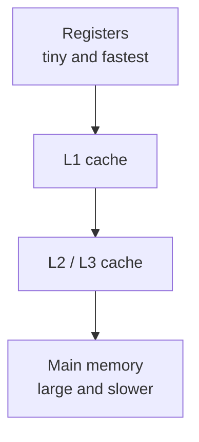
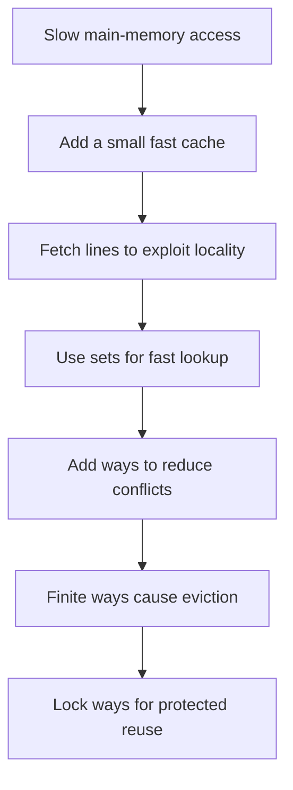

I started looking into way locking with a simple question: what exactly is being locked, and why would we deliberately stop part of a cache from behaving like a normal cache? I soon realized that way locking does not belong near the beginning of a cache explanation. It solves a problem created by several earlier design decisions, so answering that question meant going back to cache lines, sets, ways, and eviction—and following the design until way locking became necessary.

So instead of beginning with a definition, let us build a cache together.

We will start with a processor that has no cache, encounter one problem at a time, and add only the hardware needed to solve the problem in front of us. By the end, cache lines, sets, ways, eviction, and way locking should feel less like vocabulary to memorize and more like consequences of the design.

## The Processor Is Fast, but Its Data Is Far Away

Imagine that the processor wants to execute:

```c
result = a + b;
```

The addition may take only a small number of cycles. But before the processor can add anything, it needs the values of `a` and `b`. If those values are in main memory, the processor may spend far longer waiting for them than performing the addition.

This is the basic memory problem: the largest memories are usually not the fastest ones. Registers are extremely fast but can hold very little. Main memory can hold much more, but it is farther from the processor and slower to access.



Suppose we place a small, fast memory between the processor and main memory. Whenever the processor requests data, this memory checks whether it already has a nearby copy. If it does, the access is fast. If it does not, the data is fetched from the slower level and retained in case it is needed again.

That small memory is the **cache**.

An access found in the cache is a **hit**. An access that must go to the next memory level is a **miss**. At this point, our goal appears simple: keep useful data close enough that most requests become hits.

But we have not yet decided what exactly the cache should store.

## Fetching a Line Instead of a Single Value

If the processor asks for one four-byte integer, the most obvious design would fetch exactly those four bytes. That seems efficient—until we look at how programs normally access memory.

Consider a loop over an array:

```c
for (int i = 0; i < 16; i++) {
    sum += values[i];
}
```

After reading `values[0]`, the program immediately reads `values[1]`, then `values[2]`, and so on. Fetching each integer through a separate main-memory transaction would ignore a useful pattern: data close to a recently accessed address is likely to be accessed soon. This behavior is called **spatial locality**.

The cache therefore fetches a fixed-size aligned region rather than only the requested bytes. A common size is 64 bytes. If the processor requests a four-byte value at address 100, the cache may fetch the complete aligned region from address 64 through 127.

```text
Memory addresses

64                                               127
┌──────────────────────────────────────────────────┐
│                 64-byte region                   │
│                         ▲                        │
└─────────────────────────┼────────────────────────┘
                    requested value
```

The region in main memory is usually called a **memory block**. The place holding its copy inside the cache is called a **cache line**. People often use *cache block* and *cache line* interchangeably because they have the same size, but the words describe the two sides of the transfer: a memory block is copied into a cache line.

Now one miss can bring in several values that the processor is likely to use next. We spend more bandwidth on the first access, hoping to avoid many later accesses to slow memory.

We have decided the unit of transfer. Our next problem is finding a line after it has entered the cache.

## A Cache Must Be Fast to Search

Suppose the cache contains a thousand lines. When an address arrives, we could compare it against every line to find a match. That would make the cache flexible, because any memory block could live anywhere. It would also require a large number of comparisons on every access—the opposite of the fast lookup we wanted.

At the other extreme, we could give every memory block exactly one possible location. Lookup would be easy, but unrelated blocks assigned to the same location would continually replace each other.

A set-associative cache chooses a point between these extremes. Each memory block is mapped to one small region of the cache called a **set**. The cache searches only that set, not the entire cache.

A simplified mapping is:

$$
\text{set index} =
\text{memory block number} \bmod \text{number of sets}.
$$

With four sets, the mapping repeats:

| Memory block | Cache set |
|---:|---:|
| 0 | 0 |
| 1 | 1 |
| 2 | 2 |
| 3 | 3 |
| 4 | 0 |
| 5 | 1 |

Block 0 and block 4 both map to Set 0. The mapping makes lookup fast because the address tells the hardware where to search. It also creates a new problem: several blocks can want the same set even when other parts of the cache are free.

If Set 0 could hold only one line, accessing blocks 0 and 4 alternately would cause them to evict each other repeatedly. We need more than one possible home inside each set.

## Ways Give a Set More Than One Choice

Let us give every set four line slots instead of one. Each slot is called a **way**.

| Set | Way 0 | Way 1 | Way 2 | Way 3 |
|---:|---|---|---|---|
| 0 | one line | one line | one line | one line |
| 1 | one line | one line | one line | one line |
| 2 | one line | one line | one line | one line |
| ... | ... | ... | ... | ... |

A memory block still maps to only one set, so lookup remains limited. Within that set, however, the block may occupy any of four ways. This is a **four-way set-associative cache**.

A way is easiest to understand as one column of this table. It is not normally one continuous region of application memory. Way 0 means one line slot in Set 0, another line slot in Set 1, another in Set 2, and so on across every set.

This layout also gives us the cache-capacity formula. If every set contains one line per way, then

$$
\boxed{\text{total lines} = \text{number of sets} \times \text{number of ways}}.
$$

Each line holds `line size` bytes, so

$$
\boxed{\text{cache capacity} =
\text{sets} \times \text{ways} \times \text{line size}}.
$$

Take a cache with 256 sets, four ways, and 64-byte lines. It contains

$$
256 \times 4 = 1024\ \text{lines},
$$

and its data capacity is

$$
256 \times 4 \times 64
= 65{,}536\ \text{bytes}
= 64\ \text{KiB}.
$$

The formula counts the data stored in the lines. Real cache hardware also keeps metadata such as tags, valid bits, dirty bits, and replacement state, so the physical implementation needs slightly more storage than the advertised data capacity.

We have now made lookup fast and reduced conflicts by giving each set several choices. We have not eliminated conflicts entirely.

## Eviction Is the Cost of Having Finite Space

Suppose five different memory blocks map to Set 0 in our four-way cache. The first four blocks can occupy its four ways. When the fifth arrives, the set is full.

The cache cannot place that block in Set 1 because the address mapping says it belongs in Set 0. It must choose one of Set 0's existing lines and remove it. That removal is called **eviction**.

The replacement policy chooses the victim. A cache might approximate least-recently-used behavior, use a simpler pseudo-LRU scheme, or make another hardware-specific choice. The precise policy is less important here than the consequence: normal cached data has no guarantee that it will remain resident.

Most of the time, automatic replacement is exactly what we want. Software accesses memory and the cache quietly tries to retain the useful parts. But consider a small table or a tensor tile that a kernel will reuse repeatedly. Unrelated traffic may map to the same sets, evict those lines, and force the important data to be fetched again.

Now we have reached the problem that way locking is designed to solve.

## Reserving Predictable Space Changes the Cache

Imagine telling the cache controller:

> Continue using three ways normally, but do not allow the replacement policy to use the fourth way. I want to manage that space deliberately.

In a four-way cache, the result could look like this:

| Set | Way 0 | Way 1 | Way 2 | Way 3 |
|---:|---|---|---|---|
| 0 | Local memory | Cache | Cache | Cache |
| 1 | Local memory | Cache | Cache | Cache |
| 2 | Local memory | Cache | Cache | Cache |
| ... | ... | ... | ... | ... |

Way 0 contributes one protected line in every set. Normal cache traffic continues through Ways 1–3, but it cannot evict the contents placed in the reserved way.

This is **way locking** or, in some designs, **way partitioning**. The physical storage has not changed. What changes is the policy controlling part of it. Some ways remain a hardware-managed cache; the locked ways become protected space that software or firmware can manage more explicitly.

Because one way contains one line in every set, its capacity is

$$
\boxed{\text{capacity per way} =
\text{number of sets} \times \text{line size}}.
$$

For our 256-set cache with 64-byte lines, one way contributes

$$
256 \times 64 = 16\ \text{KiB}.
$$

Locking one way of the 64 KiB cache therefore creates 16 KiB of protected space and leaves 48 KiB for normal caching.

This reveals the trade-off immediately. We gain predictability for selected data, but the rest of the program now has a smaller cache. The locked data must be valuable enough to justify the additional misses that may occur in the remaining ways.

## When Locked Ways Become Local Memory

Some hardware describes those reserved ways as **Local Memory**. This can be confusing because the physical structure is still the cache array. The important difference is not the underlying storage; it is who controls the contents.

In the normal-cache portion, hardware decides what to bring in and what to evict. In the local-memory portion, software explicitly places data and expects it to remain until the partition is changed or the data is deliberately replaced.

```text
One physical storage structure
┌────────────────────────┬────────────────────────────┐
│ Software-managed space │ Hardware-managed cache     │
│ locked ways            │ remaining ways             │
└────────────────────────┴────────────────────────────┘
```

This can be useful for data with known reuse: a lookup table, a frequently executed code region, a tensor tile, or another working set whose eviction would be costly. It can also improve predictability, which matters in systems where a surprise cache miss is more than a small performance fluctuation.

The cache has therefore become a hybrid. We are trading some automatic behavior for explicit control.

## How Hardware Exposes the Partition

Once a cache supports way partitioning, software needs some way to configure it. Architectures commonly expose that control through a privileged register, but the encoding is not universal.

One design can store a **count**: reserve zero ways, one way, two ways, and so on. The hardware then follows a fixed convention—perhaps choosing the lowest-numbered or highest-numbered ways. A cache with $N$ ways needs approximately $\log_2(N)$ bits to represent those counts.

Another design can store a **way mask**, with one bit corresponding to each way. In a four-way cache, a mask such as `0101` could reserve two particular ways while leaving the other two under normal replacement. A mask provides more choice, but it requires one control bit per way.

Both controls describe complete ways. Neither one selects an individual set. A way-count field says how many columns of the cache are reserved; a way mask says which columns are reserved. Selecting only one `(set, way)` entry would require a different mechanism, such as per-line locking.

For the 64 KiB, four-way cache we have been using, a count-based partition could produce:

| Reserved ways | Local memory | Normal cache |
|---:|---:|---:|
| 0 | 0 KiB | 64 KiB |
| 1 | 16 KiB | 48 KiB |
| 2 | 32 KiB | 32 KiB |
| 3 | 48 KiB | 16 KiB |

The arithmetic comes from the cache organization, not from any particular register name. Once we know that one way contributes 16 KiB, the control simply decides how many such slices belong to each side of the partition.

## Leaving One Way for the Normal Cache

Some count-based interfaces stop at $N-1$ reserved ways for an $N$-way cache. In a four-way cache, software may assign zero, one, two, or three ways to Local Memory, but not all four.

We can understand why from the problem the cache still has to solve. Ordinary memory requests continue to arrive. Each request maps to a set, and the cache needs at least one replaceable entry in that set. If every way were removed from normal replacement, a new cacheable block would have nowhere to go unless the hardware supported bypassing the cache or switching the entire structure into a different operating mode.

Such a design chooses the simpler guarantee that at least one way in every set remains a normal cache way.

Another architecture could allow all ways to be locked, but it would have to define what happens to ordinary cacheable accesses. They might bypass the cache, use another cache level, or become invalid while the structure operates entirely as local memory. This behavior is architecture-specific rather than an inherent rule of way locking.

## Whole-Way Locking Is Not the Only Possible Design

Once we understand a cache entry as a particular `(set, way)` pair, it is natural to imagine more precise control. Hardware could attach a lock bit to every line and allow software to protect only Set 10, Way 2. It could also accept an address range and lock the lines holding that range.

Those mechanisms are technically possible, but they need additional metadata and control logic. Software may also need knowledge of physical addresses, cache indexing, coherence, and replacement behavior. Whole-way locking is coarser, but it is simple: reserve the same slot across every set and reduce the associativity of the remaining cache in a predictable way.

This is why a way-count or way-mask control cannot select one specific set. It is not an arbitrary limitation of software. The control represents a different hardware mechanism.

## Releasing the Space Requires More Than Changing a Number

If software can change the partition, it can usually return reserved ways to the normal cache. But changing the partition raises one final question: what should happen to the data already stored in those ways?

Three operations are easy to mix up:

- **Unlocking** makes a way eligible for normal cache replacement again.
- **Invalidating** marks its current contents as no longer present.
- **Writing back** copies modified, or *dirty*, contents to the next memory level.

Unlocking alone does not necessarily erase anything. The old lines may remain until normal cache traffic replaces them. If software modified data in the local-memory ways, the controller may require it to be written back before the partition changes. If stale lines must not be reused, invalidation may also be necessary.

The correct sequence depends on the architecture. A design may require some form of write-back or invalidation before its partition control is reprogrammed. The hardware specification must define the exact procedure and the privilege level required to perform it.

## The Design We Ended Up With

We began with a processor waiting on slow memory and added a small fast store. We fetched aligned lines rather than individual values because programs often access nearby data. We divided the cache into sets so that lookup would remain fast. We added several ways to each set so that blocks mapping to the same set would have more than one possible home.

Finite ways led to eviction. Eviction made automatic caching unpredictable for data that software knew it would reuse. Way locking then appeared as a controlled trade: reserve complete ways for predictable storage and leave the rest under the normal replacement policy.

The full relationship is:



Way locking is therefore not an isolated cache feature. It is a response to the cache's central compromise: hardware-managed replacement is convenient and usually effective, but it cannot guarantee that a particular working set will stay resident.

The final mental model I keep is this:

> A way is one line slot across every set. Locking a way protects that slice of the cache from normal replacement, trading general-purpose cache capacity for software-controlled, predictable storage.

Once we arrive there from first principles, a reserved-way count or mask is no longer mysterious. It simply chooses how much of the existing storage should behave like local memory and how much should continue behaving like a cache.
