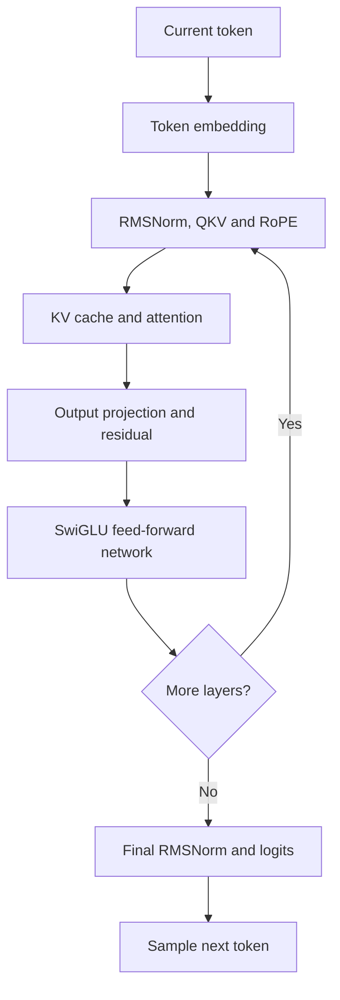
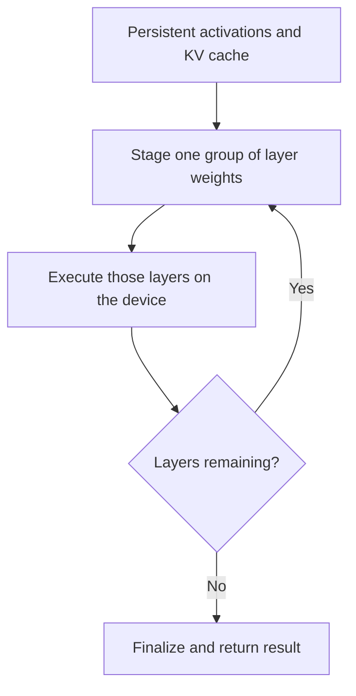

When I began porting [`llama2.c`](https://github.com/karpathy/llama2.c) to an OpenCL device, I thought I understood the shape of the work. The CPU implementation already contained the mathematics, so the task appeared straightforward: write device versions of matrix multiplication, RMSNorm, RoPE, attention, and the feed-forward network, then connect them through OpenCL.

That view lasted until I began thinking about the complete path of a token.

The kernels were important, but they were not the hardest part. The real difficulty was deciding where every piece of data should live, how long it should stay there, and when the host was allowed to reuse or overwrite it. A fast kernel was not useful if every intermediate value travelled back to the CPU. A model that fit in host memory did not necessarily fit in device memory. A synchronization call that made execution correct could also quietly serialize the entire pipeline.

By the time I generated a correct token on the OpenCL device, I had stopped thinking of the project as a collection of accelerated operations. I had started thinking of it as a small inference runtime.

This post is about that change in perspective.


## Why I Started with llama2.c

Production inference engines solve many problems at once. Along with executing the model, they may construct graphs, plan memory, select kernels, quantize tensors, schedule batches, manage KV-cache pages, reuse prompt prefixes, and serve concurrent requests. Those capabilities are valuable, but they also make it harder to see the basic mechanics of one token.

`llama2.c` takes the opposite approach. The Llama 2 forward pass is expressed directly in C using ordinary structures, loops, and arrays. Instead of entering through a large framework, I could begin with the model itself and follow its state line by line.

That made the CPU version more than a program I wanted to accelerate. It became an executable description of the model and, later, my correctness reference.

Before writing the OpenCL path, I traced a single token through the original forward pass. The token first selects an embedding. That vector then passes through every transformer layer. Each layer normalizes it, constructs the query, key, and value vectors, applies RoPE, updates the KV cache, performs attention, applies the output projection and residual connection, and finally runs the SwiGLU feed-forward network with another residual connection. After the final layer, a last RMSNorm and classifier projection produce the logits from which the next token is sampled.



On paper this is a sequence of mathematical operations. In a runtime it is also a sequence of data lifetimes. The output of one operation becomes the input of the next. Some buffers are temporary. Some survive a layer. The KV cache survives every layer invocation and every generated token. The model weights never change, but they may not all be resident on the device at the same time.

That was the first important realization: before deciding how to accelerate the computation, I had to understand the lifetime of its data.

## The First Design Question Was Not “Which Kernel?”

My initial mental model was operation-oriented. Port one function, copy its inputs to the device, launch the kernel, read the output back, and then move to the next function. This is a convenient way to validate an isolated kernel, but it is a poor way to execute an entire transformer layer.

Consider the query projection. If its result is copied back to the CPU only to be copied to the device again for RoPE or attention, the host has become an unnecessary relay between two device operations. Repeating that pattern across a transformer block adds transfers, queue operations, and synchronization around values that the CPU never actually needs.

The more useful boundary was not an individual operation. It was the longest region of the forward pass that could remain on the device.

I therefore allocated the working state once and reused it. Buffers corresponding to values such as `x`, `xb`, `q`, `k`, `v`, `hb`, and `hb2` remained available across the sequence of operations. The output of one layer stayed on the device and became the input of the next. Most importantly, the KV cache remained on the device across token-generation steps.

This exposed a distinction that I had previously glossed over: **persistent allocation** is not the same as **persistent content**.

A weight-staging buffer can be allocated once but filled with a different layer's weights later. Its allocation is persistent; its contents are not. The KV cache is different. Both the allocation and its contents must survive, because the next token needs the keys and values written by all earlier tokens.

Once I viewed the runtime this way, the model configuration stopped looking like a collection of hyperparameters and started looking like a memory contract.

The embedding width `dim` determines the size of the main activation vectors. `hidden_dim` determines the size of the feed-forward workspace. `n_layers` affects both the number of weight sets and the depth of the KV cache. `vocab_size` controls the embedding and classifier matrices. `seq_len` determines how far the cache must grow.

Even values that are not stored directly must be derived correctly. The size of one attention head is

$$
\text{head\_size} = \frac{\text{dim}}{\text{n\_heads}},
$$

while grouped-query attention gives the key and value projections a potentially smaller width:

$$
\text{kv\_dim} = \text{dim} \times
\frac{\text{n\_kv\_heads}}{\text{n\_heads}}.
$$

That one difference propagates through the K and V projection sizes, their device allocations, and every KV-cache offset. A wrong assumption here may not produce a clean crash. It can produce incorrect attention and still generate text that looks superficially believable.

I eventually found it useful to think of memory as three stories unfolding at different speeds. The weights describe the model and remain unchanged. The working buffers are rewritten as a token moves through the network. The KV cache grows with the conversation. The OpenCL design had to respect all three.

## Then the Model Stopped Fitting

Keeping intermediate state on the device solved one problem, but it raised another: what happens when the device can execute the model but cannot hold every layer's weights at once?

The answer was not to split an individual mathematical operation between the CPU and device. Instead, I kept the execution of a transformer layer on the device and streamed the model through reusable weight storage in groups of layers.

For each group, the host copied the required layer weights into device staging buffers. The device then executed those layers in order, passing the activation from one layer directly to the next. At the end of the group, the host waited for completion, reused the same staging storage for the next group, and continued from the activation already held on the device.



I exposed the group size through a `layers_per_offload` setting. A larger value keeps more weights resident at once and reduces the number of staging boundaries, but it consumes more device memory. A smaller value uses less weight storage but causes the runtime to refill it more often.

The capacity constraint can be written as:

$$
M_{\text{persistent}} + M_{\text{working}} +
N_{\text{chunk}}M_{\text{layer}} \leq M_{\text{device}}.
$$

Here, persistent memory includes data such as the KV cache; working memory includes temporary activations and scratch space; and the final term represents the weights staged for the current group of layers.

It is easy to misinterpret this scheme as reducing the amount of weight data needed for a decoded token. It does not. If the token passes through every layer, the device still consumes every layer's weights. Chunking changes *when* those weights are resident and allows execution under a limited memory capacity. It is a scheduling policy, not a reduction in the model's work.

This became one of the clearest examples of how an inference engine differs from a set of kernels. The kernel computes a layer. The runtime decides which layer weights are present, which state must survive, and when storage can be reused.

## Correctness Made Me Synchronize; Performance Made Me Reconsider It

Synchronization is reassuring during bring-up. Calling `clFinish()` after every kernel creates a simple story: launch something, wait until it is done, inspect the result, and continue. The same simplicity can become a performance problem once the full pipeline is working.

The OpenCL command queue already expresses ordering. On an in-order queue, if I enqueue kernel B after kernel A, and B reads the buffer written by A, the required dependency is preserved without forcing the host to wait between them. The host needs to block only when it must observe a result or reuse storage whose previous work may still be in flight.

That changed where I placed the synchronization boundary. Within a layer group, operations were enqueued in dependency order and their intermediate results remained on the device. I waited at the end of the group, before replacing the staged weights with the next group's weights.

The simplified shape looked like this:

```c
for (int chunk = 0; chunk < num_chunks; chunk++) {
    clEnqueueWriteBuffer(queue, weight_buffer,
                         CL_TRUE, 0, chunk_bytes,
                         chunk_weights, 0, NULL, NULL);

    for (int layer = chunk_begin; layer < chunk_end; layer++) {
        enqueue_transformer_layer(queue, layer, state);
    }

    clFinish(queue);  // staging storage can now be reused safely
}
```

The blocking write makes the current weights available before execution continues. The in-order queue carries dependencies between the layer operations. The final `clFinish()` protects the point at which the host intends to overwrite the staging buffers.

This was correct and easy to reason about, though not necessarily the final performance design. A later version could use non-blocking transfers, OpenCL events, and two weight-staging buffers so that the next group is transferred while the current group executes. But attempting that before the ownership rules were clear would have made failures much harder to diagnose.

The broader lesson was simple: synchronization belongs at a reason, not after every API call. The reason may be host visibility, cross-queue dependency, or storage reuse. Without one of those, a wait is probably just lost concurrency.

## The KV Cache Changed the Meaning of “State”

Most working buffers can be overwritten as soon as their last consumer finishes. The KV cache cannot. For every layer and every position, it preserves the key and value vectors so that future tokens can attend to the existing sequence without recomputing the past.

Conceptually, the location of a key vector is derived from the layer, token position, and key/value width:

$$
\text{offset} =
(\text{layer} \times \text{seq\_len} + \text{position})
\times \text{kv\_dim}.
$$

The value cache follows the same layout in a separate region. Its total storage is approximately

$$
M_{\text{KV}} =
2 \times \text{n\_layers} \times \text{seq\_len}
\times \text{kv\_dim} \times \text{bytes\_per\_element}.
$$

For a single position, that state looks modest compared with the model weights. Across all layers and a long sequence, it becomes significant. With multiple sequences, it grows again.

Keeping this cache on the OpenCL device avoided moving the entire attention history across the host/device boundary for every new token. It also made the indexing code one of the most sensitive parts of the port. A wrong layer stride, position stride, or grouped-query head mapping could corrupt only part of the cache. The program might continue running, but later tokens would attend to the wrong data.

This is why I stopped treating the KV cache as scratch memory. It is the persistent state of autoregressive inference. The weights tell the model what it knows; the KV cache records what it has seen in the current sequence.

## Fusion Followed Naturally from the Data Flow

Once the activations and KV cache remained on the device, launching a separate kernel for every small mathematical step began to feel artificial. It forced private intermediate values into buffers, increased launch overhead, and created more places where synchronization could accidentally enter the design.

That led me toward a fused transformer-block execution path.

The goal was not fusion for its own sake. The goal was to keep values close to their consumers. If an intermediate result exists only to feed the next part of the same layer, materializing it as a host-visible boundary offers little value. Treating the transformer block as the scheduling unit also matched the way weights were staged and layers were counted.

Fusion still has a cost. A large kernel can use more registers and local memory, reduce scheduling flexibility, and make debugging more difficult. So the useful rule was not “fuse everything.” It was this:

> Fuse along data reuse. If an intermediate value is private to a short pipeline and expensive to materialize, that pipeline is a good fusion candidate.

I used a similar idea at the end of the model. The runtime could either return the final hidden state to the CPU, where the last RMSNorm and classifier projection were executed, or keep those operations on the device and return the final result.

The CPU-finalized path was valuable during bring-up because it left a trusted part of the original implementation unchanged. If the device-computed transformer output matched the reference when finalized on the CPU, I could investigate device-side finalization separately. The device-finalized path reduced transfers and kept more of the forward pass in one execution domain, but required the final normalization and potentially large vocabulary projection to be correct and available on the device.

What looked like a performance switch also became a debugging tool. Good boundaries can serve both purposes.

## Debugging the Whole Stack, One Layer at a Time

An incorrect token does not tell you where the first mistake occurred. With an OpenCL backend, the failure may be in model parsing, a buffer size, a tensor offset, platform discovery, kernel compilation, argument binding, command ordering, a device memory access, or numerical behavior.

I learned not to begin at the generated text and work backward. Text is a weak correctness signal. A small numerical difference can change sampling, while a genuinely incorrect model can still emit plausible words for a while.

Instead, I built confidence from the bottom upward. First the OpenCL platform and device had to be discoverable. Then a small buffer had to survive a host-to-device-to-host round trip. A trivial kernel had to compile and execute. Only after that did it make sense to compare an individual operation with the CPU implementation, then a transformer layer, and finally the complete forward pass.

This layering mattered. For example, if no OpenCL platform is found, debugging the attention kernel is pointless; the loader has not yet discovered an OpenCL implementation. Similarly, if one matrix multiplication disagrees with the CPU, generated text is too far downstream to provide useful evidence.

For numerical validation, fixed input tokens and deterministic settings made comparisons reproducible. I compared intermediate tensors at selected boundaries and looked at the maximum error, average error, and the first location where results diverged substantially. The original CPU implementation remained available throughout the work, which made it possible to ask a much better question than “Does the output look right?”

The better question was: “At which operation do the two executions first stop agreeing?”

## In the End, the Bytes Mattered as Much as the Operations

The biggest performance shift in my thinking came from decode at batch size one.

Large transformer projections in that regime behave mostly like matrix-vector multiplications. Each weight may be read, used for a small amount of arithmetic, and then not reused until the next generated token. That is very different from a matrix-matrix multiplication during prefill or batched execution, where the same weights can serve many input rows.

The usual compute estimate is

$$
T_{\text{compute}} =
\frac{\text{operations}}{\text{effective compute rate}},
$$

but the corresponding memory estimate is just as important:

$$
T_{\text{memory}} =
\frac{\text{bytes moved}}{\text{effective bandwidth}}.
$$

With perfect overlap, an operation cannot be faster than the larger of those two times:

$$
T_{\text{operation}} \gtrsim
\max(T_{\text{compute}}, T_{\text{memory}}).
$$

Real overlap is rarely perfect, but even this simple model explains why peak operations per second alone is not enough to predict token generation speed.

Keeping activations on the device removed traffic that the design had created unnecessarily. Fusion reduced some intermediate reads and writes. Neither change removed the need to consume the projection weights. Chunking made those weights fit, but did not make them disappear. Quantization could reduce their storage and bandwidth cost, although it would also introduce scale handling and, depending on the design, activation conversion overhead.

This is also why prefill and decode should not be treated as the same workload. Prefill processes many prompt tokens and can expose matrix-matrix computation and greater weight reuse. Single-token decode has far less reuse and often places much more pressure on memory bandwidth. The same device—and even the same model—can therefore require different optimization strategies in the two phases.

The question I now ask first is not “How many operations can this device perform?” It is:

> For one generated token, which bytes cross each memory boundary, and how many times do they cross it?

That question usually reveals the next useful optimization.

## What the Port Ultimately Taught Me

OpenCL gave me a common way to discover the device, allocate memory, compile kernels, enqueue work, and express dependencies. It did not decide how the model should be partitioned, which buffers should remain resident, where synchronization should occur, or how kernels should be shaped for the target.

That distinction is the difference between functional portability and performance portability. The same OpenCL source may compile for two devices while their preferred work-group sizes, local-memory behavior, vector capabilities, supported built-ins, transfer costs, and compiler quality are completely different. The API is portable; an efficient execution plan still belongs to the backend.

If I continued from this design, the next steps would follow directly from the bottlenecks already exposed: replace blocking weight transfers with event-driven dependencies, double-buffer the staged weights to overlap transfer and execution, collect per-command profiling timestamps, and build separate strategies for prefill and decode. Quantized execution and larger batches would change the balance again, so I would introduce them only while retaining the CPU reference and intermediate comparisons.

The most valuable outcome, however, was not a particular optimization. It was a better mental model of an inference engine.

A kernel answers: **How do I calculate this operation on the device?**

The runtime has to answer a larger set of questions: **Where does every value live? How long must it survive? When does ownership move? What must finish before its storage can be reused?**

`llama2.c` made those questions visible because there was nowhere for the model's state to hide. I could trace a token through the complete forward pass, watch the KV cache grow, see weights and activations obey different lifetimes, and move the CPU/device boundary deliberately.

Getting the first correct token from the OpenCL device was satisfying. Understanding why it was correct—and where the time and memory went—was the more important result.

## References

- Andrej Karpathy, [`llama2.c`: Inference Llama 2 in one file of pure C](https://github.com/karpathy/llama2.c)
- Khronos Group, [The OpenCL API Specification](https://registry.khronos.org/OpenCL/specs/unified/html/OpenCL_API.html)
- Hugo Touvron et al., [Llama 2: Open Foundation and Fine-Tuned Chat Models](https://arxiv.org/abs/2307.09288)

