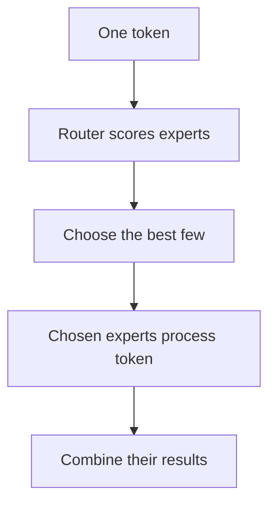

The first Mixture-of-Experts (MoE) description I read said that a model could have many parameters but use only some of them for each token.

That sentence raised more questions than it answered. What is a token? What does it mean for a parameter to be active? Is an expert a smaller language model? Does one expert learn programming while another learns mathematics?

I was trying to understand all of these terms at once. What helped was to step back and begin with what a language model is doing before experts enter the picture.

These are the notes I would want if I had to learn it again from the beginning.

## First, What Is the Model Processing?

When we give a language model a sentence, it does not read the sentence exactly as we do. The text is divided into small pieces called **tokens**. A token may be a whole word, part of a word, punctuation, or even a space combined with a word.

For example, the sentence

> The sky is blue.

might be divided into pieces resembling `The`, ` sky`, ` is`, ` blue`, and `.`. The exact split depends on the model.

Each token is turned into a list of numbers. Those numbers are the form in which the model carries information about the token. As the token passes through the model, that list is repeatedly updated using information from the surrounding tokens.

A language model contains many repeated processing stages called **layers**. One layer changes the list of numbers and passes the result to the next layer. After the final layer, the model uses the result to predict which token should come next.

We do not need to understand every operation inside a layer yet. We only need one useful detail: a typical layer contains a part that mixes information between tokens and another part that processes each token individually.

That second part is usually called a **feed-forward network**, or FFN.

## One FFN Is Shared by Every Token

I think of the FFN as a processing station inside each layer. Every token passes through it, and the same station is used for all tokens.

The FFN contains many learned numbers called **weights**. During training, the model adjusts these weights so that the FFN learns useful ways to transform the numbers representing a token.

The important point is not the exact mathematics. It is the repetition:

> In a regular layer, every token uses the same FFN weights.

If the prompt contains 100 tokens, the same FFN processes 100 token representations. Computers are good at doing this in a group. They can place those 100 inputs together and run a large bulk calculation using the shared weights.

Now imagine that we want this part of the model to learn more. One obvious approach is to make the FFN larger by giving it more weights. But a larger FFN also means that every token has more work to do. The model gains capacity, but the cost of processing each token grows with it.

This is the problem that led me to the MoE idea.

## What If the Layer Had Several FFNs?

Suppose we replace one FFN with four different FFNs. Each has its own weights and can learn a different transformation.

If every token passes through all four, we have only made the model more expensive. Every token now does four sets of work instead of one.

The useful idea is to keep all four FFNs but send one token to only one or two of them.

Those separate FFNs are called **experts**.

This was the first simple definition that stayed with me:

> An expert is usually another feed-forward network with its own weights.

The name can be misleading. An expert is not necessarily a complete model, and people do not normally assign it a job such as “handle C++” or “handle French.” The experts and their selection rules are learned during training. Some specialization may appear, but it is not safe to imagine a clear human-readable subject for every expert.

For now, it is enough to think of the experts as several possible processing stations. The model owns all of them, but a token visits only a few.

This creates an obvious question: who decides where the token goes?

## The Router Chooses the Experts

An MoE layer contains a small decision-making part called the **router**.

For every token, the router gives each expert a score. A larger score means the router currently prefers that expert for this token.

Suppose a layer has four experts and the router produces:

| Expert | Score |
|---:|---:|
| 0 | 0.12 |
| 1 | 0.67 |
| 2 | 0.08 |
| 3 | 0.42 |

If the model uses two experts per token, it selects Experts 1 and 3 because they have the two largest scores.

This selection is commonly called **top-2**. More generally, **top-$k$** means “keep the $k$ highest-scoring choices.” The letter $k$ is a count, not an expert number.

For top-1, the token uses one expert. For top-2, it uses two. Different MoE models choose different values. [Switch Transformers](https://arxiv.org/abs/2101.03961) uses one expert per token, while [Mixtral](https://arxiv.org/abs/2401.04088) chooses two from a group of eight.

The scores come from the token's current list of numbers. That list already contains some context gathered by earlier parts of the model. This means two tokens can receive different scores, and the same token can choose different experts in different layers.

The token is not assigned one expert for the rest of its life. The decision is made again at every MoE layer.

## Can One Token Choose the Same Expert Twice?

This question bothered me when I first looked at top-$k$.

For one token, standard top-2 selects two different positions from the score table. It might choose Experts 1 and 3, but it does not normally choose Expert 1 twice.

Different tokens can still choose the same expert. Token A may select Experts 1 and 3, while Token B selects Experts 0 and 1. Expert 1 appears in both decisions.

That repetition across tokens is allowed and expected. It later becomes important because the computer can group all tokens that selected Expert 1 and process them together.

If several experts have exactly the same score, the top-$k$ operation must break the tie somehow. The exact winners depend on the software implementation, but the result still contains $k$ different expert positions.

## What Happens After Two Experts Are Chosen?

Suppose the router sends a token to Experts 1 and 3. Both experts process the token's current numbers. The model now has two results, but the next layer expects only one.

The router scores are therefore also used to decide how much each result should contribute. The model forms a weighted mixture of the two expert outputs and sends that single combined result forward.

This is where the word *mixture* begins to make sense. With top-2 routing, the output is a mixture of two expert results. The token does not continue as two separate tokens.

## Total Parameters and Active Parameters

I could now return to the sentence that originally confused me.

A **parameter** is one of the learned numbers stored in the model. The expert weights make up a large part of the parameters in an MoE model.

Imagine that the model has eight experts, but each token uses only two. All eight experts must still be stored because another token may choose any of them. Those weights contribute to the model's **total parameters**.

For one token, only the two selected experts perform work. Their weights contribute to the expert parameters **active for that token**.

So “inactive” does not mean deleted or absent from memory. It means that those expert weights are not used for this particular token at this particular layer.

This is the main attraction of MoE. The model can store many possible learned paths without running every path for every token. It gains more total capacity without increasing the work per token in direct proportion to the total number of experts.

But the inactive experts still occupy storage. A 40-billion-parameter MoE model does not shrink to a 10-billion-parameter file merely because only 10 billion parameters are active for one token. Sparse use reduces computation; it does not erase the rest of the model.

## The Saving Creates New Work Elsewhere

At first, MoE sounded like an easy win: keep more knowledge, use less computation. Following the token showed me the new work that comes with it.

The router has to calculate scores. The model has to find the highest scores. Tokens choosing the same expert need to be gathered together. After the experts finish, their results must return to the correct tokens and be combined.

There is another complication. The experts may not receive equal numbers of tokens. If ten tokens choose Expert 1 and only one chooses Expert 3, those experts have different amounts of work.

Training often encourages the model to use its experts more evenly, because a model that sends everything to one expert is not making good use of the others. But routing still follows the token scores. It is not a strict turn-taking system that sends one token to each expert in order.

This is the trade I want to remember:

> A regular model gives every token the same path. MoE saves work by letting tokens take different paths, but those paths must now be chosen, grouped, and scheduled.

The original [MoE paper](https://arxiv.org/abs/1701.06538) calls this *conditional computation*: the model runs only the parts chosen for the current input. Later systems explore different ways of handling the uneven work. I find those solutions easier to understand after seeing why the unevenness exists.

## The Picture I Want to Keep

When I hear “Mixture of Experts” now, I picture one token moving through a layer:

The token reaches a router. The router scores several FFNs. The best few process the token. Their results are combined into one output. At the next MoE layer, the choice happens again.

That picture explains why a model can have many parameters but activate fewer for one token. It also leads to the next question: what happens when a whole prompt sends many tokens through the router at once?

That is what I explore in [*MoE Routing During Prefill: Why Experts Receive Unequal Work*]().

## Further Reading

- Noam Shazeer et al., [*Outrageously Large Neural Networks: The Sparsely-Gated Mixture-of-Experts Layer*](https://arxiv.org/abs/1701.06538)
- William Fedus, Barret Zoph, and Noam Shazeer, [*Switch Transformers*](https://arxiv.org/abs/2101.03961)
- Albert Q. Jiang et al., [*Mixtral of Experts*](https://arxiv.org/abs/2401.04088)
