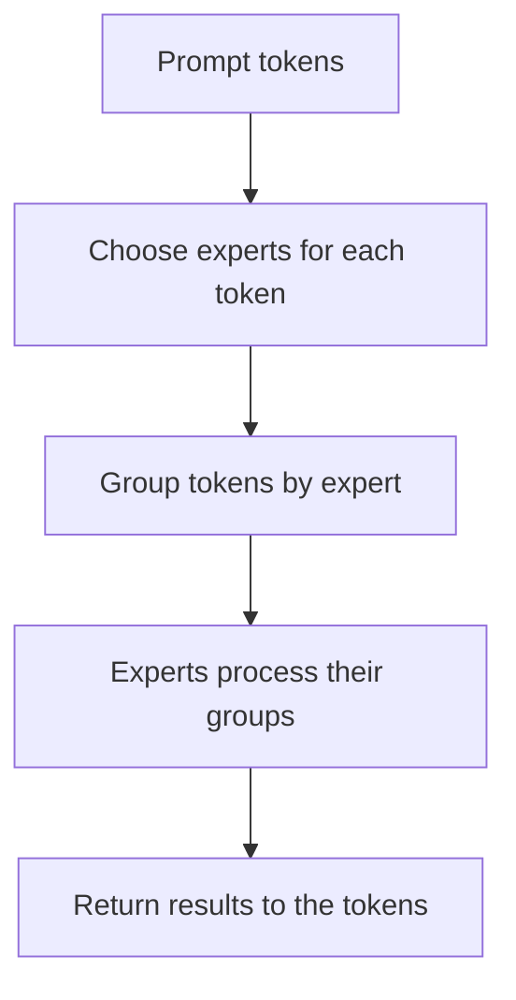

*This is Part 2 of my MoE notes. If terms such as token, expert, router, or top-$k$ are unfamiliar, Part 1—[*From a Regular Language Model to Mixture of Experts*]()—starts from the beginning.*

Once I understood that an MoE model chooses experts separately for every token, I formed a simple picture in my head: take one token, choose its experts, finish its work, and then move to the next token.

That picture is useful for learning how routing works, but it is not how a complete prompt has to be processed.

When the model first receives our prompt, many tokens are already available. It can make all their routing decisions and then collect together the tokens that chose the same expert. This creates batches of work for the experts.

The surprising part is that these batches are rarely the same size.

## A Prompt Is Processed in Two Phases

Suppose we ask a language model:

> Why is the sky blue?

Before the model can write an answer, it must first read and process the question. This first phase is called **prefill**.

During prefill, the model processes all the tokens already present in the prompt. It builds the internal information needed to understand the prompt and to begin predicting an answer.

After that, the model generates the answer one new token at a time. This second phase is called **decode**. It predicts one token, adds it to the conversation, predicts the next token, and continues.

The short version is:

- **Prefill:** process the input tokens we already have.
- **Decode:** generate new tokens one at a time.

An MoE router chooses experts in both phases. The difference is how many token decisions are available together. Prefill may expose hundreds or thousands of prompt tokens at once. A single conversation during decode contributes only one new token at each step.

That difference changes how the expert work can be grouped.

## The Router Does Not Choose One Expert for the Prompt

One mistake I made was to imagine that the router looked at the complete prompt and selected a few experts for the whole thing.

It does not normally work that way. The router makes a new choice for every token at every MoE layer.

If a prompt contains eight tokens and the model uses top-2 routing, the router makes eight separate choices. Each choice contains two different expert numbers.

Here is one possible result for a layer with four experts:

| Token | Experts chosen for it |
|---:|---|
| 0 | 0 and 1 |
| 1 | 0 and 2 |
| 2 | 0 and 1 |
| 3 | 0 and 3 |
| 4 | 1 and 2 |
| 5 | 0 and 1 |
| 6 | 2 and 3 |
| 7 | 0 and 2 |

There are eight tokens and two choices per token, so the layer has 16 token-to-expert assignments.

Looking down the table, Expert 0 appears much more often than Expert 3. Regrouping the same choices by expert makes this easier to see:

| Expert | Tokens it receives | Number of tokens |
|---:|---|---:|
| 0 | 0, 1, 2, 3, 5, 7 | 6 |
| 1 | 0, 2, 4, 5 | 4 |
| 2 | 1, 4, 6, 7 | 4 |
| 3 | 3, 6 | 2 |

All 16 assignments are still present:

$$
6+4+4+2=16.
$$

They are simply not shared equally. Expert 0 receives six token inputs, while Expert 3 receives only two.

This unequal list—6, 4, 4, 2—is the actual work created by this prompt at this layer.

## Why Not Give Every Expert Four Tokens?

There are 16 assignments and four experts, so the average is four assignments per expert. Why does the router not simply give each expert four?

Because the router's first job is to choose useful experts for each token, not to divide the work like a card dealer.

The scores depend on the token's current information inside the model. Tokens from the same prompt are related to one another, so it is reasonable for several of them to prefer the same expert.

During training, MoE models are usually encouraged to make use of all their experts. This prevents the model from sending nearly every token to one favourite expert and ignoring the rest. But “encouraged to stay balanced” does not mean “every prompt must be divided exactly equally.”

A strict turn-taking rule could give every expert four tokens, but it would sometimes ignore the router's learned preferences. MoE models instead try to keep a useful balance over time while still allowing individual tokens to choose the experts that score well for them.

That distinction cleared up my confusion:

> The router can use all experts reasonably across many inputs while one particular prompt still gives them unequal work.

## The Computer Rearranges the Tokens by Expert

After routing, the tokens are still stored in their original order: Token 0, Token 1, Token 2, and so on.

That order is convenient for following the prompt, but not for running the experts. Expert 0 needs Tokens 0, 1, 2, 3, 5, and 7. Expert 3 only needs Tokens 3 and 6.

The computer therefore rearranges the work. It makes one group for every expert:

- Expert 0 gets a group of 6 token inputs.
- Expert 1 gets a group of 4.
- Expert 2 gets a group of 4.
- Expert 3 gets a group of 2.

This grouping step is often called **dispatch**. The name sounds more complicated than the action: send each token input to the experts chosen for it.

Each expert then processes its group. Afterward, the results are returned to the original token positions, and the selected expert results are combined for each token.

This is the point that changed my picture of prefill. The tokens make separate choices, but they do not have to be processed as many separate one-token jobs. Tokens that chose the same expert can be collected and processed together.

## Why Prefill Is Not Just Decode Repeated Many Times

During decode for one conversation, only one new token is being generated at a time. With top-2 routing, that token goes to two experts. Each selected expert receives one token input from that conversation at that moment.

During prefill, many prompt tokens are available together. In our example, Expert 0 receives six inputs at once. The computer can process those six using one larger bulk calculation.

This matters because the expert's weights are shared by all six inputs. The computer can bring a section of those weights close to its calculation units and reuse it across several tokens instead of doing a separate setup for each token.

The plain version I remember is:

> Decode often gives an expert one token of work. Prefill can give it a group of tokens.

This does not mean prefill is always fast. The result depends on the prompt length, model size, memory speed, and hardware. It only means prefill provides more opportunity to group work and reuse expert weights.

If a server generates tokens for many conversations together, decode can also form groups. Several new tokens from different conversations may choose the same expert. The grouping opportunity then comes from serving multiple conversations at once rather than from one prompt.

## Is a Popular Expert Good or Bad?

My first reaction to the 6, 4, 4, 2 split was that Expert 0 was a problem. It has three times as many tokens as Expert 3.

That can indeed slow the layer down. If four experts run in parallel on four equal pieces of hardware, Expert 3 may finish its two tokens while Expert 0 is still processing six. The layer may have to wait for Expert 0 before all token results are ready.

But Expert 0 also has the best opportunity for efficient grouped work. Its weights are being used for six tokens. Expert 3 has only two tokens with which to reuse its weights and keep the hardware busy.

So repeated choices have two effects:

- They create a larger, potentially more efficient group for the popular expert.
- They can make that expert take longer than the others.

This is why “unequal” does not automatically mean “bad.” The result depends on how the work is placed and scheduled on the hardware.

There is another useful question: how many different experts did the prompt touch? If a model has 64 experts but a small prompt uses only 12 at one layer, the computer may need only those 12 sets of expert weights for that work. If the choices are spread across all 64, more different weights participate, often in smaller groups.

The number of experts used and the number of tokens sent to each expert tell us more than the top-$k$ setting alone.

## What If One Expert Receives Too Many Tokens?

Some systems reserve a fixed number of token slots for each expert. This makes memory planning easier because the system knows how large each expert's input area can become.

But routing does not promise to respect an equal split. If too many tokens choose one expert, the system must decide what to do with the extra ones. It may leave spare room when planning the slots, send the extra tokens elsewhere, or skip some assignments depending on the model design.

Every choice has a cost. Reserving large fixed areas wastes space when experts receive only a few tokens. Filling unused slots with dummy work wastes computation. Skipping assignments changes the work performed by the model.

Research systems take different approaches. [MegaBlocks](https://arxiv.org/abs/2211.15841) is designed to process uneven expert groups without dropping tokens. [Expert Choice Routing](https://arxiv.org/abs/2202.09368) changes the direction of selection: instead of every token choosing experts freely, experts choose tokens up to a limit.

I do not need the details of those methods to understand why they exist. They are different responses to the same simple observation: real routing can produce 6, 4, 4, 2 instead of 4, 4, 4, 4.

## The Router Is Also Creating a Work Schedule

Before the router runs, the computer knows the number of tokens, experts, and choices per token. It can calculate the average work, but it does not know the real split.

After routing, it knows that Expert 0 has six tokens, Experts 1 and 2 have four each, and Expert 3 has two. It can now decide which expert to start first, whether a large group should use more hardware, and whether data for one expert can be moved while another is working.

These decisions belong to the software that runs the model. Different hardware will prefer different plans. A machine that can keep every expert nearby has a different problem from one that must fetch expert weights from slower memory.

The important point is simple: the prompt affects the expert choices, and the expert choices affect the shape of the work. The schedule cannot be fully known from the model size alone.

## The Picture I Want to Remember

My original statement was correct but incomplete: every token chooses its own experts.

During prefill, the useful continuation is:

> Many token choices are available together, so the computer groups repeated expert choices and gives every expert a batch of tokens.

Those batches are usually unequal. A popular expert may take longer, but it may also reuse its weights across more tokens. An unpopular expert has less work, but its small group may use the hardware poorly.

That is the mental picture I want to keep: prefill begins with a prompt in token order, routing rearranges it into expert groups, and the sizes of those groups come from the prompt itself.

## Further Reading

- Noam Shazeer et al., [*Outrageously Large Neural Networks: The Sparsely-Gated Mixture-of-Experts Layer*](https://arxiv.org/abs/1701.06538)
- William Fedus, Barret Zoph, and Noam Shazeer, [*Switch Transformers*](https://arxiv.org/abs/2101.03961)
- Yanqi Zhou et al., [*Mixture-of-Experts with Expert Choice Routing*](https://arxiv.org/abs/2202.09368)
- Trevor Gale et al., [*MegaBlocks*](https://arxiv.org/abs/2211.15841)
